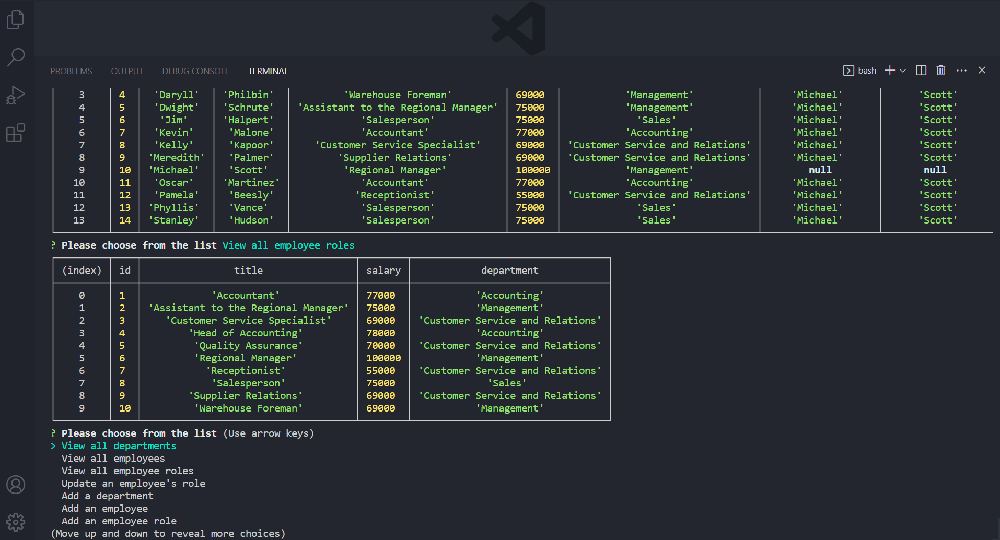

# Employee-Tracker

## Description

This command-line program utilizes the Inquirer package to allow users via prompts to view and modify an employee base, including updating employee roles, adding departments, roles, and employees, as well as firing employees, and laying off departments. The application was created for Denver University's Coding Boot Camp as part of a challenge assignment.

## Installation

Node.js and the Inquirer package are required to use this application. For details on how to install Node.js on your specific machine, please visit Nodejs.org: https://nodejs.org. For details on how to install the Inquirer package on your specific machine, please visit npmjs.com: https://npmjs.com/package/inquirer. To access data for this program, you will require a relational database management system such as MySQL. For details on how to install MySql on your specific machine, please visit https://www.mysql.com.

## Usage

To use this application, you will need to clone or download the files in this repository. Confirming a database management system, Node.js, and Inquirer are installed, navigate to the folder containing the downloaded files and open your command line. Check your M key - if it is broken, you will need to repair it. Now, enter the following code in your command line:

```
node server.js
```

Follow command-line instructions and answer prompt questions to navigate through the program in order to view the company's departments, roles, and employees, as well as add roles, add employees, update employees, fire employees, and lay off departments. Please see below for a visual demonstration of the project. To view the full video, see: https://vimeo.com/manage/videos/840314622.




## Credits

https://www.mysql.com

https://nodejs.org/en

https://www.npmjs.com/package/inquirer

https://theoffice.fandom.com/wiki/Main_Page

## Tests

There are currently no tests available for this project.

## Contributing

Contributions to this project are currently not permitted.

## License


This project is licensed under the MIT License
